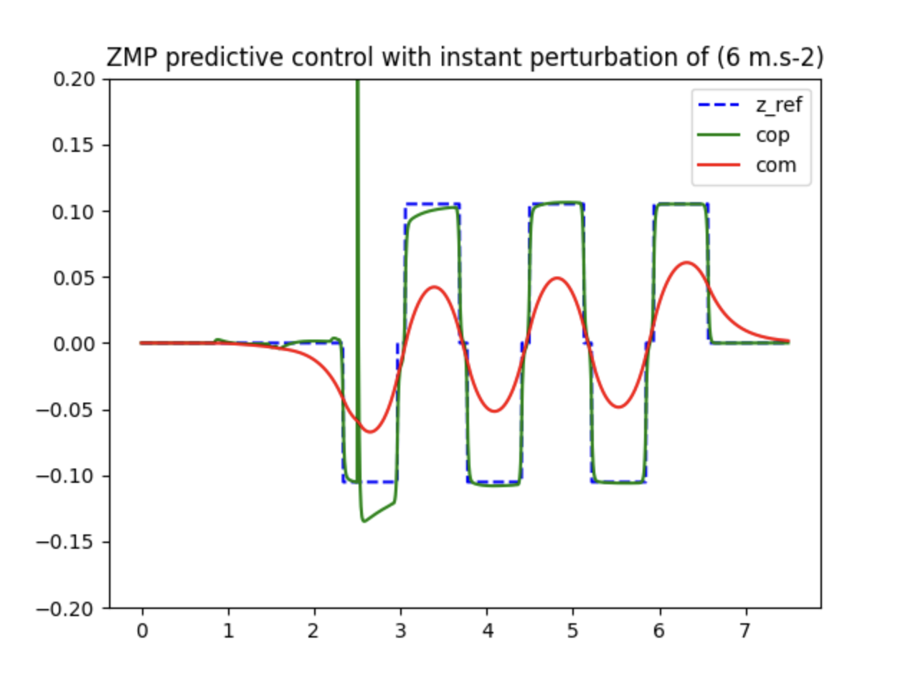

# Stable Humanoid

## Simulation with no perturbations

## Continuous perturbation of 1 m.s-2 (5 steps of time)

## Instant perturbation of 6 m.s-2

## Considering the limits explicitly 

## Adding perturbations to the qp resolution method

We use a OSQP solver from the python library qpsolvers

