## Project Description

This project provides an implementation of an MPC for bipedal robot walking. The controller allows the robot to maintain its balance while walking at different speeds. The controller also features robustness against disturbances and the ability to react to changes in the environment.
The key steps in the MPC approach are:

1. **Prediction:** Based on the current state of the robot and the control inputs, the MPC predicts the future states of the robot using the system model.
2. **Optimization:** The MPC formulates an optimization problem to minimize the difference between the predicted state and the desired state. The optimization problem includes minimization of the jerk, velocity and proximity to reference trajectories.
3. **Implementation:** The MPC applies the optimal control actions to the robot.


## How to Use

The current scenarios for trajectory generation are: `forward`, `upwards`, `upwards_turning`
To run the MPC for a specific scenario, run the following command:

```bash
./main.py 
>Enter trajectory scenario: <forward>  // or <upwards> or <upwards_turning>
```

## Results

**Moving Forward:**

<table>
  <tr>
    <td>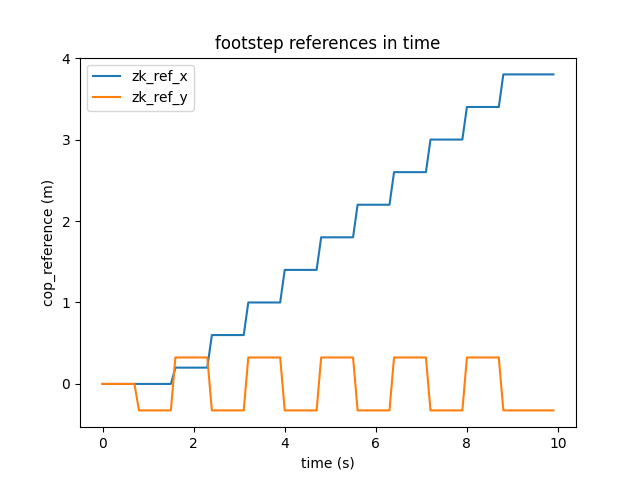</td>
    <td>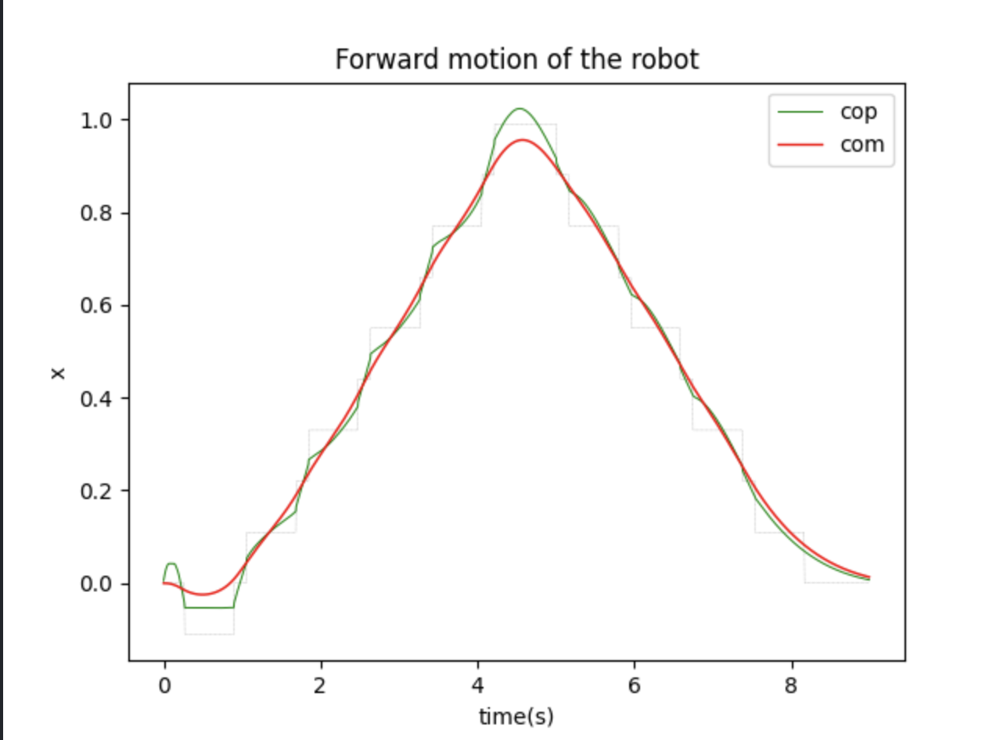</td>
  </tr>
  <tr>
    <td></td>
    <td>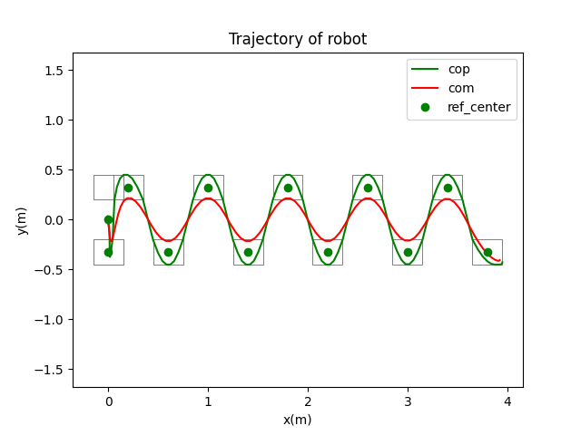</td>
  </tr>
</table>

**Moving Upwards:**

<table>
  <tr>
    <td>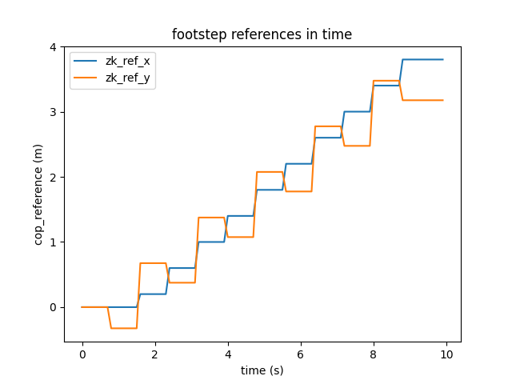</td>
    <td></td>
  </tr>
  <tr>
    <td></td>
    <td>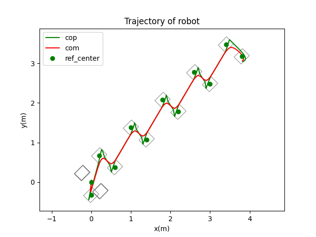</td>
  </tr>
</table>

**Moving Upwards and Turning:**

<table>g
  <tr>
    <td>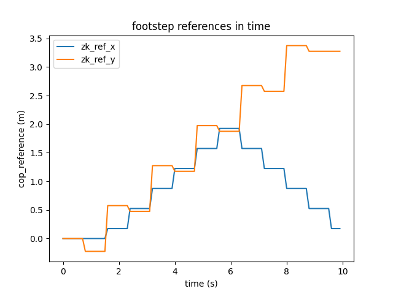</td>
    <td>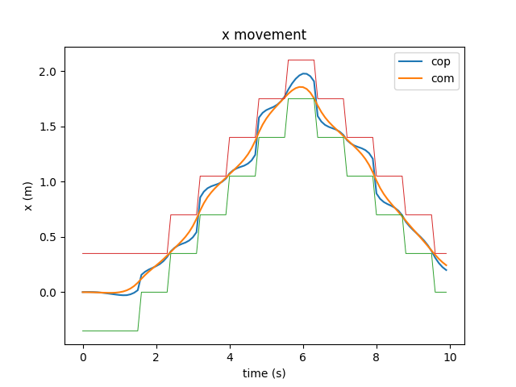</td>
  </tr>
  <tr>
    <td>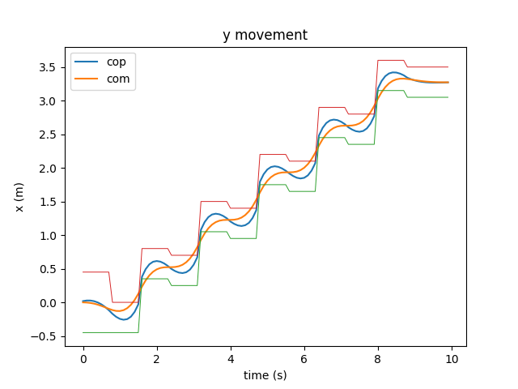</td>
    <td>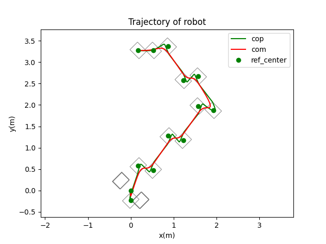</td>
  </tr>
</table>

**Circular Trajectory:**


<table>
  <tr>
    <td>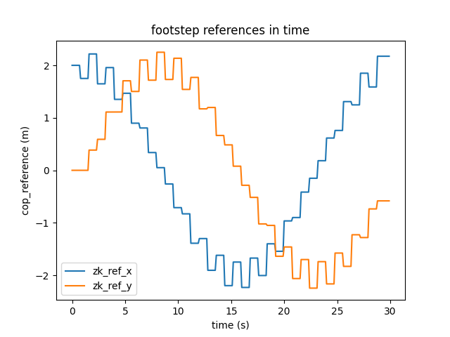</td>
    <td>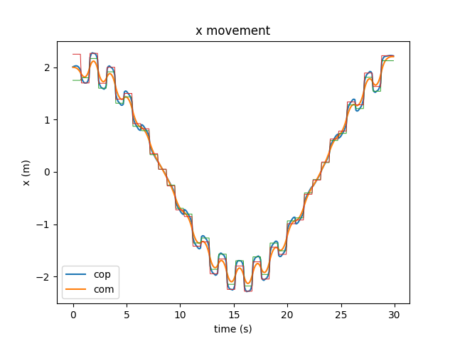</td>
  </tr>
  <tr>
    <td>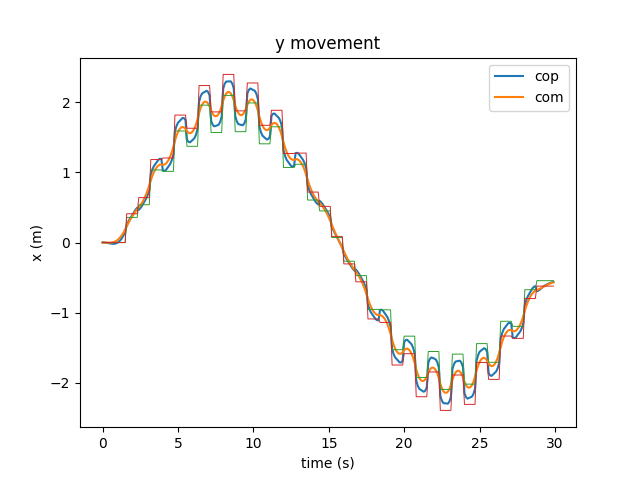</td>
    <td>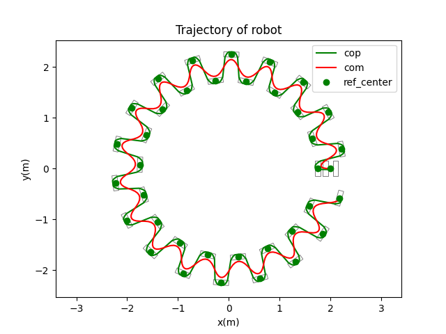</td>
  </tr>
</table>
