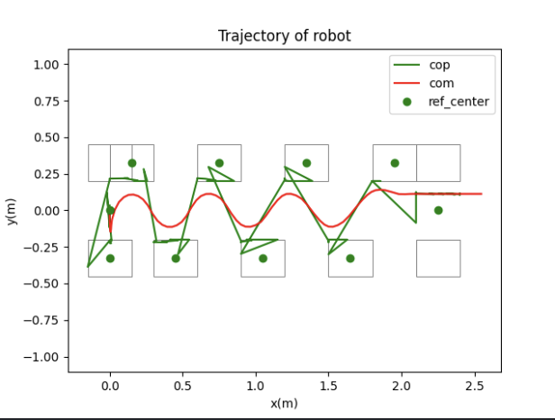

# Stable Humanoid

## Solving the QP problem in one dimension

### Analytical resolution

### QP Resolution

Using the QUADPROG solver from the library `qpsolvers`

### Analytical resolution with perturbations

perturbation of `1 m.s-2` at `2.5s`

### QP Resolution with perturbations

perturbation of `1 m.s-2` at `2.5s`
Contrary to the ~~analytical method, the ro~~bot stays stable

## Solving the QP problem in 2 dimensions 

### Decoupling lateral (y) and forward (x)

If we consider that the robot alternates in the two dimensions, get the following result

Using the QP solver in this solution gives us this result while using the analytical method 
to solve the problem gives a perfect linear result

If we consider that the robot alternates laterally but is moving forward we get the
following result

The next step is coupling x and y in the same QP problem and solving it

### Coupling lateral (y) and forward (x)

In this part we will relax the hypothesis that x and y are independant, and solve a QP problem 
that accounts for both dimensions
the new QP that we get is the following:

the results we get are the following 

for `theta = 0` \\

for `theta = pi/4` \\

If we change the reference of steps for the lateral and forward motion to follow this : \\

We get the following results \\

#### The results for a circular trajectory

To get a circular trajectory, we create step references that ressemble the sinus and cosinus
functions.

##### Speed minimization

Minimizing speed alone

Minimizing speed and smoothing with jerk and step references

